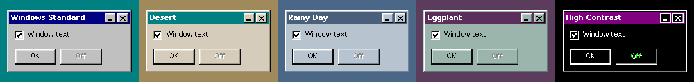
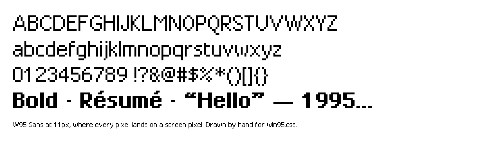

# win95.css

A Windows 95 interface kit for the web. One stylesheet gives you windows, title bars, menus, the taskbar,
the Start menu and every classic control, drawn pixel for pixel with the original four-tone bevels,
an original pixel font and hand-drawn icons. An optional script (6 KB gzipped) makes the windows drag,
resize, minimize and stack, and adds right-click menus, submenus and modal dialogs.

Plain HTML. No framework, no build step for you, no dependencies. 19 KB of CSS gzipped, font and icons included.


**[Live demo](https://concirillo-41.github.io/win95.css/)** · double-click the icons, right-click the desktop,
try the Start menu. Or open `docs/index.html` locally.

## Install

```html
<link rel="stylesheet" href="https://cdn.jsdelivr.net/npm/win95.css@0.1/dist/win95.css">
<script src="https://cdn.jsdelivr.net/npm/win95.css@0.1/dist/win95.js" defer></script>
```

jsDelivr also serves minified copies: ask for `win95.min.css` and `win95.min.js` instead.

Or with npm:

```bash
npm i win95.css
```

```js
import 'win95.css/win95.css'; // the stylesheet (Vite, webpack, Next.js, Parcel…)
import 'win95.css';           // the optional script; adds a global W95
```

Opt in with a class, so nothing else on your page changes:

```html
<body class="w95">
```

## A window

```html
<section class="w95-window" id="readme" data-icon="notepad" data-w="480" data-h="360">
  <div class="w95-titlebar">
    <span class="w95-ico-notepad"></span>
    <span class="w95-title">README.TXT - Notepad</span>
    <div class="w95-controls">
      <button data-action="minimize" aria-label="Minimize"></button>
      <button data-action="maximize" aria-label="Maximize"></button>
      <button data-action="close" aria-label="Close"></button>
    </div>
  </div>
  <div class="w95-body">Hello from 1995.</div>
  <span class="w95-grip"></span>
</section>
```

Without the script, that is a static window you can drop anywhere in a page. With the script and a
`.w95-desktop` around it, it becomes a real window: anything with `data-open="readme"` opens it, and
`#readme` in the URL opens it on arrival. `docs/index.html` is a complete desktop to copy from.

## Components

| Class | What it is |
|---|---|
| `button`, `.w95-btn`, `.is-default`, `.is-active` | Push buttons, the default button frame, the pressed state |
| `input`, `select`, `textarea`, checkbox, radio, range | Restyled native controls with stable sizes |
| `fieldset` + `legend` | Group box |
| `.w95-window`, `.w95-titlebar`, `.w95-controls`, `.w95-body`, `.w95-grip` | Windows |
| `.w95-menubar`, `.w95-menu` | Menu bar, drop-down, cascading and right-click menus |
| `.w95-toolbar` (`.is-big`) | Flat toolbar buttons that pop up on hover |
| `.w95-statusbar`, `.w95-statusfield` | Status bar |
| `.w95-tabs`, `[role=tab]`, `.w95-tabpanel` | Property-sheet tabs |
| `.w95-list`, `.w95-table`, `.w95-tree`, `.w95-iconview` | List box, details view, tree view, large-icon view |
| `.w95-progress > span` with `--value: 40%` | Chunky progress bar |
| `.w95-msg` | Message box layout with a 32px icon |
| `.w95-ruler`, `.w95-page-well`, `.w95-page` | A WordPad document |
| `.w95-panel`, `.w95-inset` | Sunken and shallow wells |
| `[data-tip="..."]`, `.w95-tooltip` | Yellow tooltips |
| `.w95-desktop`, `.w95-icons`, `.w95-desk-icon` | Desktop and its icons |
| `.w95-taskbar`, `.w95-start`, `.w95-tasks`, `.w95-tray`, `.w95-clock`, `.w95-startmenu` | Taskbar and Start menu |
| `.w95-safe` | "It's now safe to turn off your computer." |

### Menus, submenus and right-click menus

A menu is a list of buttons. Give an item `aria-haspopup="menu"` and point it at a nested list to make
a cascading submenu; it opens on hover, tap, or the right arrow key, and flips left at the screen edge.
This works in menu bars, right-click menus and the Start menu.

```html
<ul class="w95-menu" id="desk-menu" hidden>
  <li><button aria-haspopup="menu" aria-controls="arrange" aria-expanded="false">Arrange Icons</button>
    <ul class="w95-menu" id="arrange" hidden>
      <li><button>by Name</button></li>
      <li><button>by Type</button></li>
    </ul>
  </li>
  <li class="w95-sep" role="separator"></li>
  <li><button data-open="properties">Properties</button></li>
</ul>

<div class="w95-icons" data-contextmenu="desk-menu">…</div>
```

`data-contextmenu` opens that menu on right-click, a long press on touch screens, or Shift+F10 and the
menu key. Choosing an item closes it. Wrap a letter in `<span class="w95-key">` to underline it.

### Modal dialogs

```html
<section class="w95-window" id="restart" data-modal data-w="360" data-h="auto" hidden>…</section>
```

A modal opens centred and blocks the desktop until it closes. Click past it and its title bar flashes,
the way Windows said no. Focus starts on the `.is-default` button, Tab stays inside, and Esc closes it.

### Colour schemes



```html
<html data-scheme="rainy-day">
```

`standard`, `desert`, `rainy-day`, `eggplant` and `high-contrast` (High Contrast Black: white edges,
purple selection, green disabled text, white control glyphs). Set it on `<html>` for the whole page or
on any element to theme just that part, or call `W95.scheme('desert')`.

### The font



W95 Sans is an original pixel font drawn for this kit: capitals 8px tall, x-height 6px, 139 characters
including accents, and a bold weight. It is built at 11px, where every pixel lands on a screen pixel,
and ships inside `dist/win95.css` (3 KB per weight). The files are also in `fonts/` if you want the font
on its own. Set `--w95-font` to use another face.

### Icons

16 original 16×16 pixel icons, drawn for this project (no Microsoft artwork): `folder`, `computer`,
`notepad`, `doc`, `recycle`, `globe`, `mail`, `briefcase`, `controls`, `floppy`, `paint`, `cd`, `star`,
`error`, `info`, `warning`. Use `<span class="w95-ico-folder"></span>`; add `.w95-ico-32` for desktop size.

### The 1996 web

For pages shown inside a browser window: `.w95-web` (tiled paper, Times), `.w95-counter` (hit counter),
`.w95-construction` (under construction tape), `.w95-marquee`, `.w95-badge-new`, `.w95-blink`.

## The script

`win95.js` reads plain attributes; there is nothing to configure.

- `data-open="id"` opens a window. Desktop icons open on double-click with a mouse and on one tap on touch screens.
- `data-action="close | minimize | maximize | shutdown"`.
- `data-w`, `data-h` (`auto` sizes a dialog to its content), `data-center`, `data-modal`, `data-icon` (taskbar icon).
- `data-contextmenu="menu-id"` for right-click menus; `aria-haspopup="menu"` for submenus.
- Menus, tabs, the clock and the Start menu work from their ARIA attributes. Esc closes menus; arrow keys move through menus, submenus and tabs.
- Events: `w95:open` and `w95:close` bubble from each window, `w95:contextmenu` from a right-click menu, `w95:scheme` on `document`.
- `W95.open(id)`, `W95.close(id)`, `W95.focus(id)`, `W95.scheme(name)`, `W95.contextMenu(id, x, y)`, `W95.closeMenus()`, `W95.shutdown()`.

TypeScript types ship in `types/win95.d.ts` and load automatically.

### With React, Vue or Svelte

The script listens at the page level, so windows, menus and icons you render later work without any
setup. Load it once (`import 'win95.css'`), render the markup, and let your framework own the content
while `win95.js` owns the windows. If your framework re-renders a window, keep its `id` stable.

## Phones

Below 640px every window opens maximized above the taskbar, dragging turns off, icons grid up,
the type grows to 13px, and a long press opens right-click menus.

## Customising

Everything is a custom property: `--w95-desktop`, `--w95-face`, `--w95-title`, `--w95-font`, `--w95-size`,
and the bevels `--w95-raised`, `--w95-sunken` and friends. Want Windows 98 gradients?
Set `.w95-titlebar { background: linear-gradient(90deg, #000080, #1084d0) }` and live your truth.

## Building and testing

```bash
npm install
npx playwright install chromium
npm test
```

`npm test` builds `dist/` and walks the demo in headless Chromium at desktop and phone sizes. See
[CONTRIBUTING.md](CONTRIBUTING.md) for how to add an icon or a character to the font.

## Credits

The font and icons are original. [98.css](https://github.com/jdan/98.css) by Jordan Scales is the project
that proved this was a good idea. Windows is a trademark of Microsoft. This project is not affiliated
with or endorsed by Microsoft.

MIT © Con Cirillo
