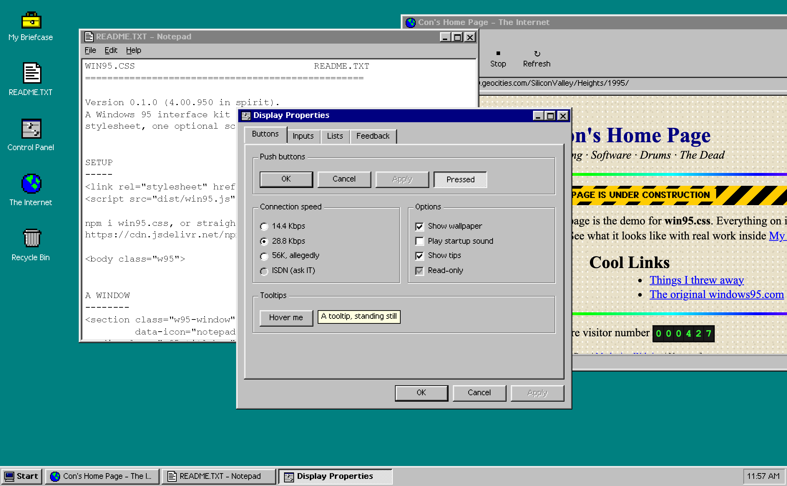

# win95.css

A Windows 95 interface kit for the web. One stylesheet gives you windows, title bars, menus, the taskbar,
the Start menu and every classic control, drawn pixel for pixel with the original four-tone bevels.
An optional script (4 KB gzipped) makes the windows drag, resize, minimize and stack.

Plain HTML. No framework, no build step for you, no dependencies.



**[Live demo](https://concirillo-41.github.io/win95.css/docs/)** · double-click the icons. Or open `docs/index.html` locally.

## Install

```html
<link rel="stylesheet" href="https://cdn.jsdelivr.net/npm/win95.css/dist/win95.css">
<script src="https://cdn.jsdelivr.net/npm/win95.css/dist/win95.js" defer></script>
```

or `npm i win95.css` and import `win95.css/dist/win95.css`.

Opt in with a class, so nothing else on your page changes:

```html
<body class="w95">
```

## A window

```html
<section class="w95-window" id="readme" data-icon="notepad" data-w="480" data-h="360">
  <div class="w95-titlebar">
    <span class="w95-ico-notepad"></span>
    <span class="w95-title">README.TXT - Notepad</span>
    <div class="w95-controls">
      <button data-action="minimize" aria-label="Minimize"></button>
      <button data-action="maximize" aria-label="Maximize"></button>
      <button data-action="close" aria-label="Close"></button>
    </div>
  </div>
  <div class="w95-body">Hello from 1995.</div>
  <span class="w95-grip"></span>
</section>
```

Without the script, that is a static window you can drop anywhere in a page. With the script and a
`.w95-desktop` around it, it becomes a real window: anything with `data-open="readme"` opens it, and
`#readme` in the URL opens it on arrival.

## Components

| Class | What it is |
|---|---|
| `button`, `.w95-btn`, `.is-default`, `.is-active` | Push buttons, the default button frame, the pressed state |
| `input`, `select`, `textarea`, checkbox, radio, range | Restyled native controls with stable sizes |
| `fieldset` + `legend` | Group box |
| `.w95-window`, `.w95-titlebar`, `.w95-controls`, `.w95-body`, `.w95-grip` | Windows |
| `.w95-menubar`, `.w95-menu` | Menu bar and drop-down menus |
| `.w95-toolbar` (`.is-big`) | Flat toolbar buttons that pop up on hover |
| `.w95-statusbar`, `.w95-statusfield` | Status bar |
| `.w95-tabs`, `[role=tab]`, `.w95-tabpanel` | Property-sheet tabs |
| `.w95-list`, `.w95-table`, `.w95-tree`, `.w95-iconview` | List box, details view, tree view, large-icon view |
| `.w95-progress > span` with `--value: 40%` | Chunky progress bar |
| `.w95-msg` | Message box layout with a 32px icon |
| `.w95-ruler`, `.w95-page-well`, `.w95-page` | A WordPad document |
| `.w95-panel`, `.w95-inset` | Sunken and shallow wells |
| `[data-tip="..."]`, `.w95-tooltip` | Yellow tooltips |
| `.w95-desktop`, `.w95-icons`, `.w95-desk-icon` | Desktop and its icons |
| `.w95-taskbar`, `.w95-start`, `.w95-tasks`, `.w95-tray`, `.w95-clock`, `.w95-startmenu` | Taskbar and Start menu |
| `.w95-safe` | "It's now safe to turn off your computer." |

### The font

W95 Sans is an original pixel font drawn for this kit: capitals 8px tall, x-height 6px, 130 characters
including accents, and a bold weight. It is built at 11px, where every pixel lands on a screen pixel,
and ships inside `dist/win95.css` (3 KB per weight). Set `--w95-font` to use another face. The character
grids live in `tools/font.mjs`.

### Icons

16 original 16×16 pixel icons, drawn for this project (no Microsoft artwork): `folder`, `computer`,
`notepad`, `doc`, `recycle`, `globe`, `mail`, `briefcase`, `controls`, `floppy`, `paint`, `cd`, `star`,
`error`, `info`, `warning`. Use `<span class="w95-ico-folder"></span>`; add `.w95-ico-32` for desktop size.

### The 1996 web

For pages shown inside a browser window: `.w95-web` (tiled paper, Times), `.w95-counter` (hit counter),
`.w95-construction` (under construction tape), `.w95-marquee`, `.w95-badge-new`, `.w95-blink`.

## The script

`win95.js` reads plain attributes; there is nothing to configure.

- `data-open="id"` opens a window. Desktop icons open on double-click with a mouse and on one tap on touch screens.
- `data-action="close | minimize | maximize | shutdown"`.
- `data-w`, `data-h` (`auto` sizes a dialog to its content), `data-center`, `data-icon` (taskbar icon).
- Menus, tabs, the clock and the Start menu work from their ARIA attributes. Esc closes menus; arrow keys move through menus and tabs.
- Events: `w95:open` and `w95:close` bubble from each window. `window.W95.open(id)` and `W95.close(id)` for code.

## Phones

Below 640px every window opens maximized above the taskbar, dragging turns off, icons grid up,
and the type grows to 13px. Touch opens icons with one tap.

## Customising

Everything is a custom property on `:root`: `--w95-desktop`, `--w95-face`, `--w95-title`, `--w95-font`,
`--w95-size`, and the bevels `--w95-raised`, `--w95-sunken` and friends. Want Windows 98 gradients?
Set `.w95-titlebar { background: linear-gradient(90deg, #000080, #1084d0) }` and live your truth.

## Building

```bash
npm run build
```

`tools/build.mjs` draws the icons from their character grids, builds W95 Sans from `tools/font.mjs`
into WOFF2 (with opentype.js and wawoff2), inlines both and writes `dist/win95.css` and `dist/win95.js`.
Run `npm install` first.

## Checking changes

`tools/shoot.mjs` drives the demo in headless Chrome (Playwright) at desktop and phone sizes and reports
console errors and sideways overflow.

## Credits

The font and icons are original. [98.css](https://github.com/jdan/98.css) by Jordan Scales is the project
that proved this was a good idea. Windows is a trademark of Microsoft. This project is not affiliated
with or endorsed by Microsoft.

MIT © Con Cirillo
